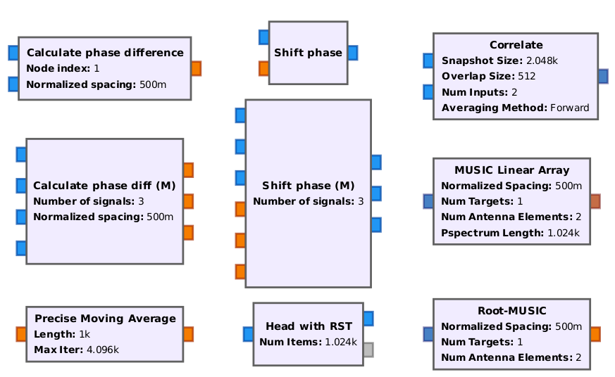
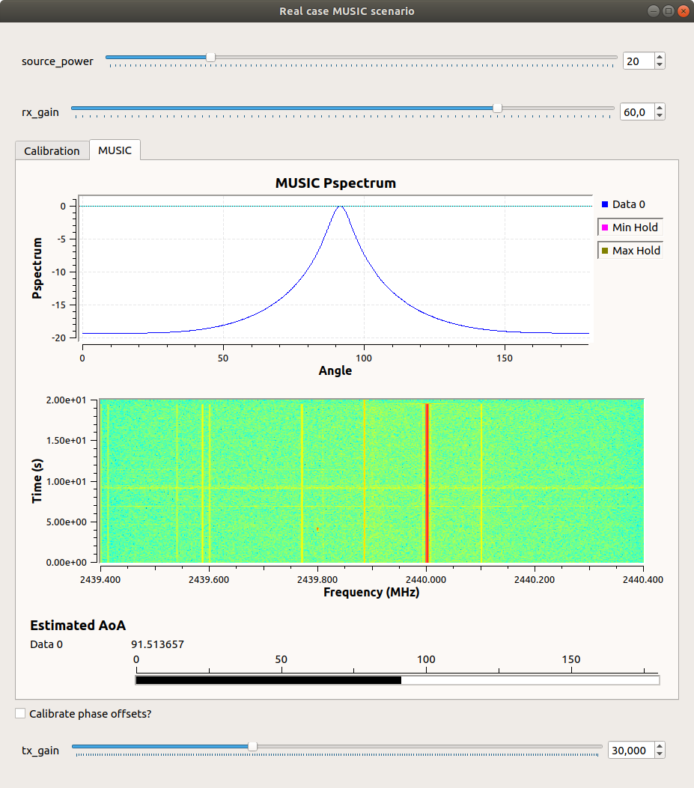
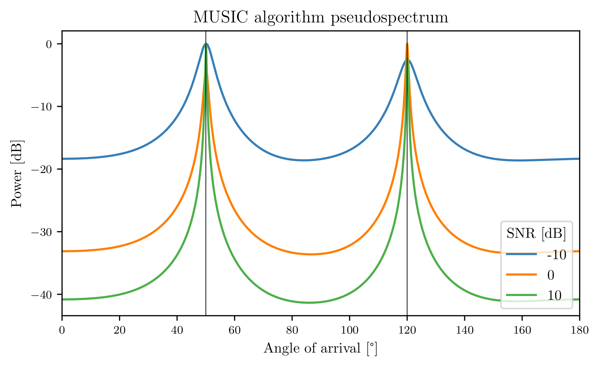

# GNU Radio USRP AoA
GNU Radio package implementing MUSIC and root MUSIC angle of arrival algorithms with blocks necessary to provide phase synchronization of USRP devices.
This is an updated and improved version of https://github.com/EttusResearch/gr-doa.

**Implemented blocks:**
<p align="center">
  
</p>

**Exemplary GR GUI:**
<p align="center">
  
</p>

**Installation procedure:**
```
cd
git clone https://github.com/MarcinWachowiak/GNU-Radio-USRP-AoA
cd GNU-Radio-USRP-Beamforming/gr-aoa

mkdir build
cd build
cmake ..
make -j$(nproc)

sudo make install
sudo ldconfig
```
This repository also contains simulation of MUSIC algorithm and parametric analysis implemented in Python.

**Exemplary simulation results:**

<p align="center">
  
</p>

